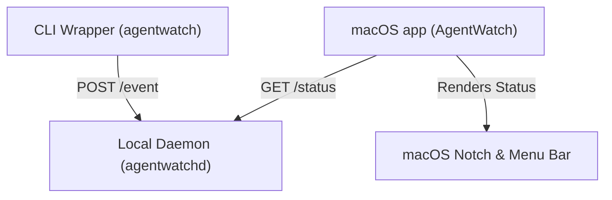

# AgentWatch 🕶️

AgentWatch is a lightweight, real-time activity and progress tracker designed specifically for CLI-based AI coding agents (such as Antigravity, Claude Code, and Codex CLI). It intercepts the agent's interactive terminal output in a pseudo-terminal (PTY) wrapper, parses the stream using stateful heuristics, and renders live status badges and animations directly in your macOS Menu Bar and hardware Notch.

> [!NOTE]
> AgentWatch is designed for macOS and fits perfectly with the physical hardware notch on modern MacBooks, expanding dynamically when your agents are working and collapsing when they go idle.

---

## Architecture

AgentWatch is split into three main components:



1. **CLI Wrapper (`agentwatch`)**: 
   A Go-based PTY wrapper that intercepts output/input stream bytes, normalizes line endings (`\r` to `\n`), strips ANSI codes, and applies smart checks to determine whether the agent is **Initializing**, **Running** (thinking/generating/executing tools), or **Waiting** (idle and prompting user).
2. **Daemon (`agentwatchd`)**: 
   A lightweight local background HTTP server (`http://127.0.0.1:8765`) that coordinates session events from running wrappers and exposes them to the desktop app.
3. **SwiftUI macOS App (`AgentWatch`)**: 
   A native AppKit/SwiftUI menu bar helper that anchors a custom overlay window around the physical MacBook notch, animating an active Unicode Braille spinner (`⣾`, `⣽`, `⣻`...) and displaying process stats.

---

## Features

- **Zero-Config Wrapping**: Wrap any CLI command or agent by simply prefixing it:
  ```bash
  agentwatch agy
  # or
  agentwatch claude
  # or
  agentwatch codex
  ```
  Interactive Codex sessions automatically use Codex's inline display mode so AgentWatch can detect when a turn is ready for your next prompt.
- **Dynamic Notch Overlay**: A black pill-shaped overlay that expands from the sides of the MacBook notch when agents are busy, and seamlessly transitions away when they finish.
- **Smart Idle & Busy Heuristics**:
  - Differentiates active thinking spinners from historical completion logs (e.g. Claude's `✻ Crunched for 2s`).
  - Supports custom prompts (`❯`, `User:`, `>`, `$`) and filters typing echoes.
  - Recognizes Codex CLI's terminal-title activity signal, composer, and approval prompts.
  - Normalizes carriage returns (`\r`) to ensure visual lines map correctly to terminal screen updates.
- **Live Agent Dropdown**: See a breakdown of all active agents, their states (Color-coded pills), and messages right from the macOS Menu Bar.

---

## Setup & Building

### Prerequisites
* Go 1.20+
* macOS 13+ with Xcode Command Line Tools (for building the Swift App)

### 1. Build the CLI Wrapper & Daemon
Compile the Go binaries from the root of the project:
```bash
go build -o bin/agentwatch cmd/agentwatch/main.go
go build -o bin/agentwatchd cmd/agentwatchd/main.go
```

### 2. Build the macOS App
Compile the native SwiftUI application:
```bash
cd apps
swift build -c release
```

---

## Usage

1. **Start the background services**:
   Run the convenience script to launch the daemon and the SwiftUI overlay app in the background:
   ```bash
   ./start_all.sh
   ```
   You will see an eye icon (`👀`) appear in your macOS menu bar.

2. **Run your agent**:
   Open a new terminal session and launch your agent wrapped with `agentwatch`:
   ```bash
   ./bin/agentwatch agy
   # or
   ./bin/agentwatch claude
   # or
   ./bin/agentwatch codex
   ```

3. **Watch the Notch**:
   * As soon as the agent initializes, the Notch will expand with a **Blue** indicator.
   * When the agent is thinking or working, an animated **White** Braille spinner (`⣾`) will cycle.
   * When the agent stops and prompts you for input, the Notch collapses automatically.

To stop the services, return to the tab where `./start_all.sh` is running and press `Ctrl+C`.
