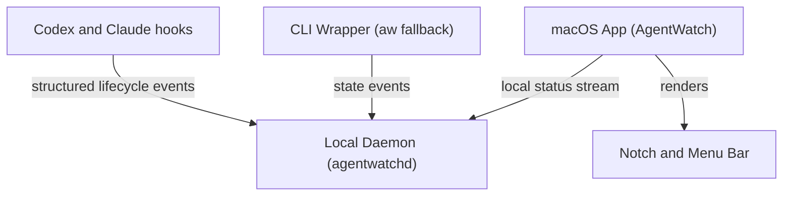

# AgentWatch 🕶️

AgentWatch is a lightweight, real-time activity tracker for CLI-based AI coding agents such as Codex CLI, Claude Code, and Antigravity (`agy`). It shows when an agent is working, needs permission or input, or has finished—directly in the macOS menu bar and MacBook notch.

> [!IMPORTANT]
> AgentWatch is an early-access macOS project. There is no signed binary release or Homebrew package yet, so early adopters currently build it from source.

> [!NOTE]
> AgentWatch works on macOS 13 or newer. The notch overlay is designed for MacBooks with a physical notch, while the menu-bar interface remains available on other Macs.

## Features

- Tracks multiple concurrent agent sessions.
- Distinguishes starting, running, tool execution, permission, input, completion, failure, and orphaned states.
- Shows permission and input attention indicators in the notch.
- Recognizes Codex's terminal-title activity signal and interactive composer.
- Tracks ordinary Codex and Claude launches through lifecycle hooks.
- Preserves interactive terminal behavior through a pseudo-terminal (PTY).
- Runs locally without sending prompts or terminal output to an external AgentWatch service.

## Install for early access

### Requirements

- macOS 13 Ventura or newer
- Git
- Go 1.26.5 or the version declared in [`go.mod`](go.mod)
- Xcode Command Line Tools with Swift 5.9 or newer
- At least one supported CLI agent already installed, such as `codex`, `claude`, or `agy`

Install the Xcode Command Line Tools if needed:

```bash
xcode-select --install
```

Verify the build tools:

```bash
go version
swift --version
```

### Build and install

Clone the repository and run the installer:

```bash
git clone https://github.com/prasetyobu21/agentwatch.git
cd agentwatch
./install.sh
```

The installer:

- Builds the Go CLI and daemon.
- Builds the native SwiftUI application.
- Installs `AgentWatch.app` in `/Applications`.
- Installs the `aw` command in `/opt/homebrew/bin`, `/usr/local/bin`, or `~/bin`, depending on the machine.

If the fallback `~/bin` location is used and `aw` is not found, add it to the shell path:

```bash
echo 'export PATH="$HOME/bin:$PATH"' >> ~/.zshrc
source ~/.zshrc
```

## Start AgentWatch

Launch the installed application:

```bash
open -a AgentWatch
```

An eye icon should appear in the menu bar. Launching the app also starts its bundled local daemon; you do not need to run `agentwatchd` separately.

To start AgentWatch automatically after login:

1. Open **System Settings → General → Login Items**.
2. Add `/Applications/AgentWatch.app` under **Open at Login**.

## Install agent hooks

Hook installation is an explicit second step so AgentWatch never changes agent
configuration during `./install.sh`:

```bash
aw hooks install all
```

Install only one integration if preferred:

```bash
aw hooks install codex
aw hooks install claude
```

The command changes only these hook sections:

- Codex: `~/.codex/hooks.json`
- Claude: `~/.claude/settings.json`

Existing settings are preserved. Before changing an existing file, AgentWatch
creates an adjacent `.agentwatch.bak` once. The hooks observe lifecycle events,
never return allow/deny decisions, and quietly exit if AgentWatch is not running.

Start a new Codex or Claude session after installing. If Codex asks you to
review the new commands, open `/hooks` and trust the AgentWatch entries.

## Use AgentWatch with an agent

Keep AgentWatch running and launch Codex or Claude normally—no wrapper:

```bash
codex
claude
```

Antigravity does not expose the same hooks yet, so continue using the wrapper:

```bash
aw agy
```

Arguments are passed directly to each agent:

```bash
codex --model <model>
claude --continue
```

The PTY wrapper remains available as a fallback. Wrapped Codex and Claude
sessions automatically suppress their hook events to avoid duplicate entries.

Interactive Codex sessions automatically use inline display mode so AgentWatch can reliably detect when Codex is ready for the next prompt.

### Status indicators

- **Blue spinner:** The agent is starting.
- **White spinner:** The agent is thinking, generating, or executing a tool.
- **Attention message:** An agent needs permission or user input.
- **Green checkmark:** A task has completed.
- **Menu-bar dropdown:** Displays individual sessions and their current states.

Quit AgentWatch from its menu-bar dropdown when you no longer need it. Quitting the app also stops the daemon it started.

## Update an early-access installation

Quit the currently running AgentWatch app from its menu-bar dropdown. Then, from the cloned repository:

```bash
git pull
./install.sh
aw hooks install all
open -a AgentWatch
```

## Run from the repository without installing

For development or evaluation without copying files into `/Applications`:

```bash
./build_app_bundle.sh
./start_all.sh
```

Install hooks that point to the development binary, then launch an agent normally:

```bash
./bin/aw hooks install all
codex
```

Press `Ctrl+C` in the `start_all.sh` terminal to stop the development app and daemon.

## Troubleshooting

### `aw: command not found`

Locate the installed wrapper:

```bash
ls -l /opt/homebrew/bin/aw /usr/local/bin/aw "$HOME/bin/aw" 2>/dev/null
```

If it was installed in `~/bin`, add that directory to `PATH` using the instructions above.

### The menu-bar icon does not appear

Confirm that the application is installed and launch it explicitly:

```bash
ls -ld /Applications/AgentWatch.app
open /Applications/AgentWatch.app
```

If macOS blocks the locally built app, open **System Settings → Privacy & Security** and review the displayed security message. Only allow an app that you built from a repository and commit you trust.

### The app opens but no session appears

Make sure:

1. The eye icon is visible in the menu bar.
2. Hooks were installed with `aw hooks install all` and the agent was restarted.
3. Codex or Claude was launched directly; Antigravity was launched with `aw agy`.
4. Port `127.0.0.1:8765` is not already occupied by another program.

Check the daemon snapshot:

```bash
curl http://127.0.0.1:8765/v1/status
```

## Privacy and local data handling

AgentWatch does not send prompts, typed input, terminal output, or state data to
an external AgentWatch API. Hooks forward only normalized lifecycle metadata,
such as session ID, state, and tool name. Prompt text, tool arguments, responses,
and transcript contents are ignored.

The fallback wrapper temporarily examines a small recent-output buffer and
terminal-screen model in memory to classify activity. It records only
short-lived input categories such as `text`, `enter`, or `escape`, not the
characters typed.

The daemon receives normalized state metadata and retains current sessions plus a limited event history in memory. It listens only on `127.0.0.1:8765`, so it is not exposed to other devices on the network. The local HTTP API is currently unauthenticated, which means another process already running on the same Mac could read or spoof state metadata. Raw prompts and terminal output are not available through this API.

The terminal application may independently retain visible content in its scrollback or logs; that behavior is outside AgentWatch.

## Architecture



1. **Hooks:** Codex and Claude invoke the local `aw hook` relay, which emits normalized state metadata and always returns without making permission decisions.
2. **CLI wrapper (`aw`):** Provides PTY-based tracking for agents without supported hooks and remains available as a fallback.
3. **Daemon (`agentwatchd`):** Coordinates sessions on `127.0.0.1:8765` and publishes snapshots and server-sent events.
4. **macOS app (`AgentWatch`):** Starts the bundled daemon, consumes its local state stream, and renders the menu-bar and notch interfaces.

## Build components manually

Build the Go binaries:

```bash
go build -o bin/aw ./cmd/agentwatch
go build -o bin/agentwatchd ./cmd/agentwatchd
```

Build the Swift application executable:

```bash
swift build --package-path apps -c release
```

Or build the complete `.app` bundle:

```bash
./build_app_bundle.sh
```
